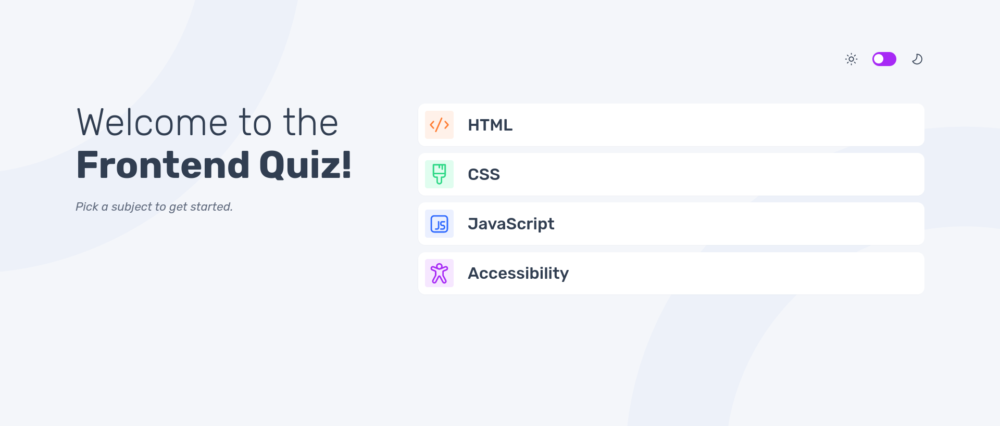
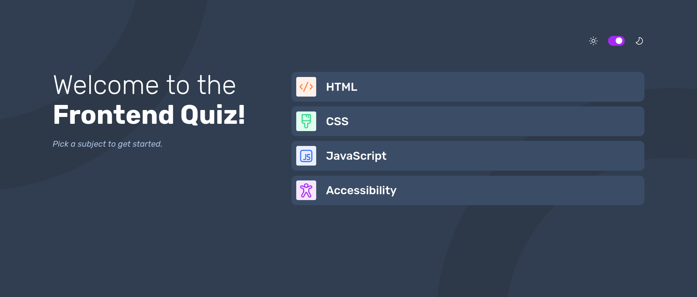

# Frontend Mentor - Frontend quiz app solution

This is a solution to the [Frontend quiz app challenge on Frontend Mentor](https://www.frontendmentor.io/challenges/frontend-quiz-app-BE7xkzXQnU). Frontend Mentor challenges help you improve your coding skills by building realistic projects. 

## Table of contents

- [Overview](#overview)
  - [The challenge](#the-challenge)
  - [Screenshot](#screenshot)
  - [Links](#links)
  - [Built with](#built-with)
  - [What I learned](#what-i-learned)
  - [Useful resources](#useful-resources)
- [Author](#author)

## Overview

Quiz application where you can select the topic you want among the existing ones and take a test on it. At the end of the test you receive a score based on your successes and failures.

### The challenge

Users should be able to:

- Select a quiz subject
- Select a single answer from each question from a choice of four
- See an error message when trying to submit an answer without making a selection
- See if they have made a correct or incorrect choice when they submit an answer
- Move on to the next question after seeing the question result
- See a completed state with the score after the final question
- Play again to choose another subject
- View the optimal layout for the interface depending on their device's screen size
- See hover and focus states for all interactive elements on the page
- **Bonus**: Change the app's theme between light and dark

### Screenshot

### Links

- Solution URL: [Add solution URL here](https://quizz-app-b8f24.web.app/)
- Live Site URL: [Add live site URL here](https://quizz-app-b8f24.web.app/)

### Built with

- Semantic HTML5 markup
- SASS
- Mobile-first workflow
- [Tailwind](https://tailwindcss.com/) - CSS framework
- [Angular](https://angular.dev/) - TS framework

### What I learned

It helped me deepen my knowledge of Angular 17 and Tailwind CSS

### Useful resources

- [Example resource 1](https://stackoverflow.com/questions/78271234/error-while-setting-up-json-server-auth-cannot-find-module-json-server) - This helped me because I was having a problem with the deployment of the json server.

## Author

- Linkedin - [Laura Elena Mesa](https://www.linkedin.com/in/lauraelenamesa/)
- Frontend Mentor - [@laurymesa01](https://www.frontendmentor.io/profile/laurymesa01)

